# Diseño de Microservicios — Fukusuke BackEnd

---

## 1. Diagrama de Clases con los Microservicios

### 1.1 Microservicios Identificados

| Microservicio | Puerto | Responsabilidad única |
|---|---|---|
| `auth-service` | 3001 | Autenticación, registro y gestión de tokens JWT |
| `user-service` | 3002 | Perfil de usuario y direcciones de despacho |
| `product-service` | 3003 | Catálogo de productos y categorías |
| `cart-service` | 3004 | Gestión del carrito de compras |
| `order-service` | 3005 | Ciclo de vida completo del pedido |
| `payment-service` | 3006 | Procesamiento de pagos |
| `notification-service` | 3007 | Envío de notificaciones por correo |
| `report-service` | 3008 | Reportes semanales de ventas para el administrador |

---

### 1.2 Vista General — Arquitectura de Microservicios

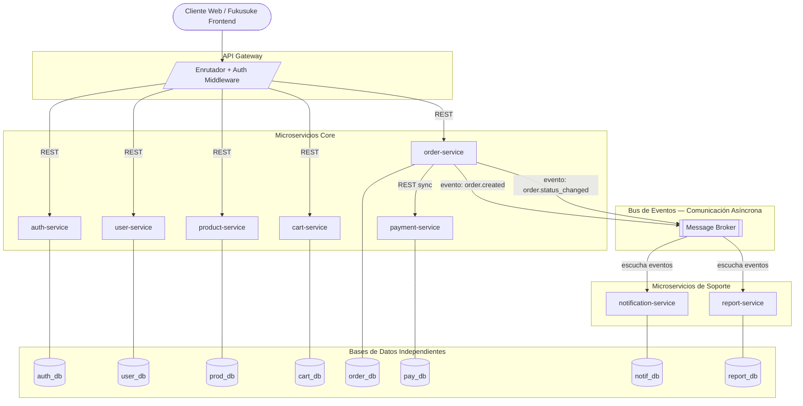

---

### 1.3 Diagrama de Clases del Dominio

Este diagrama muestra las clases principales, sus atributos, métodos y relaciones entre microservicios.

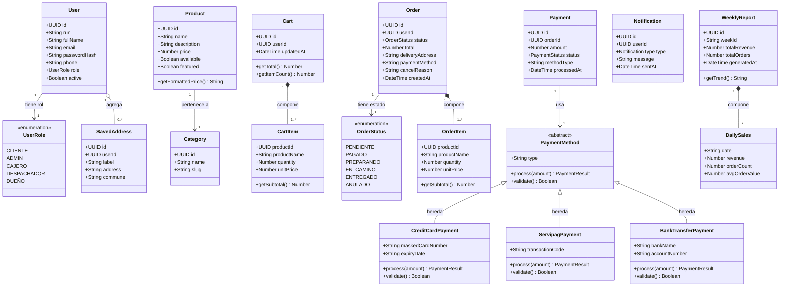

---

### 1.4 Estructura Interna — Patrón Aplicado a Todos los Microservicios

Todos los microservicios aplican una arquitectura en **4 capas** idéntica:

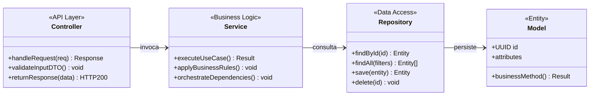

---

### 1.5 Diagrama Interno — auth-service

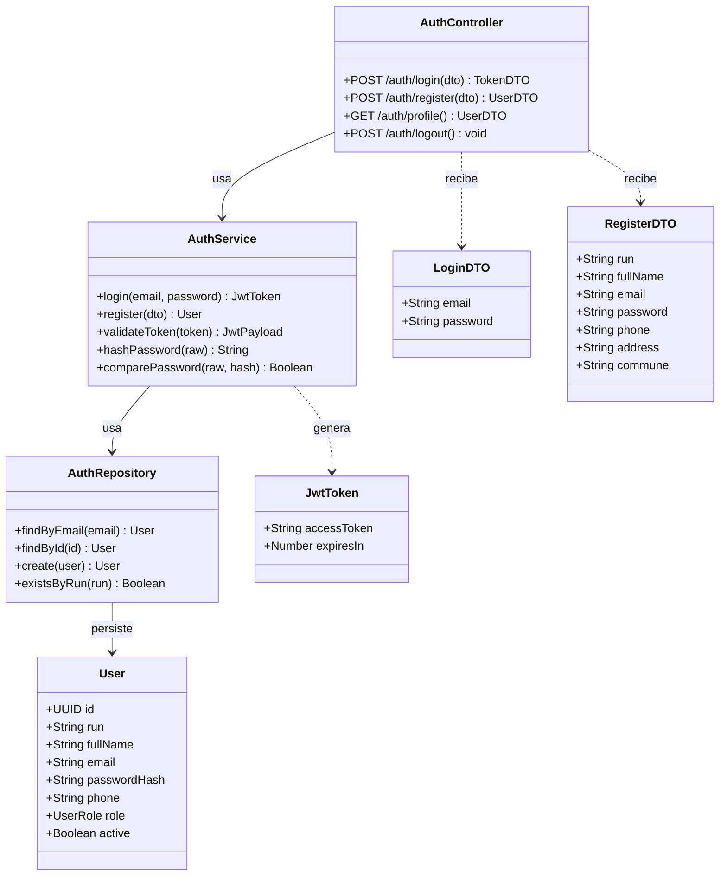

---

### 1.6 Diagrama Interno — user-service

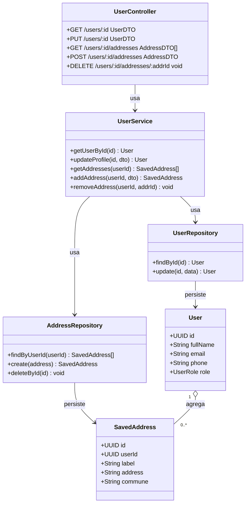

---

### 1.7 Diagrama Interno — product-service

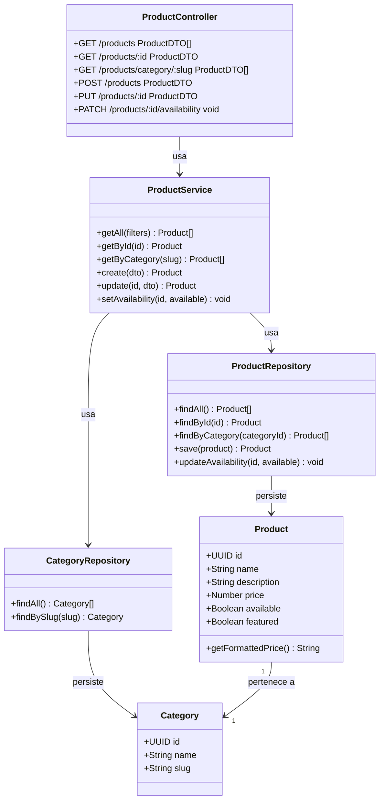

---

### 1.8 Diagrama Interno — cart-service

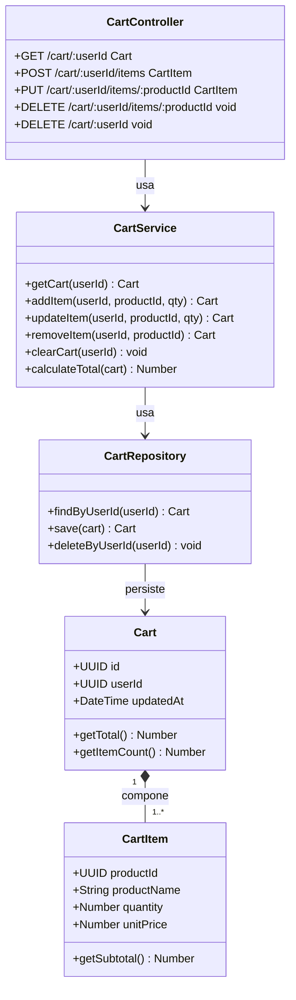

---

### 1.9 Diagrama Interno — order-service

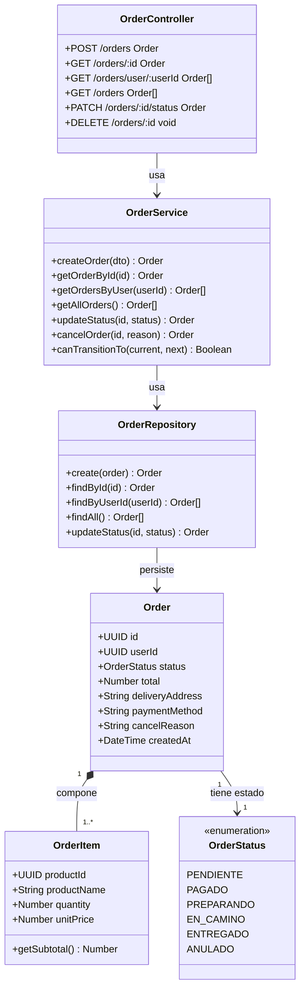

---

### 1.10 Diagrama Interno — payment-service

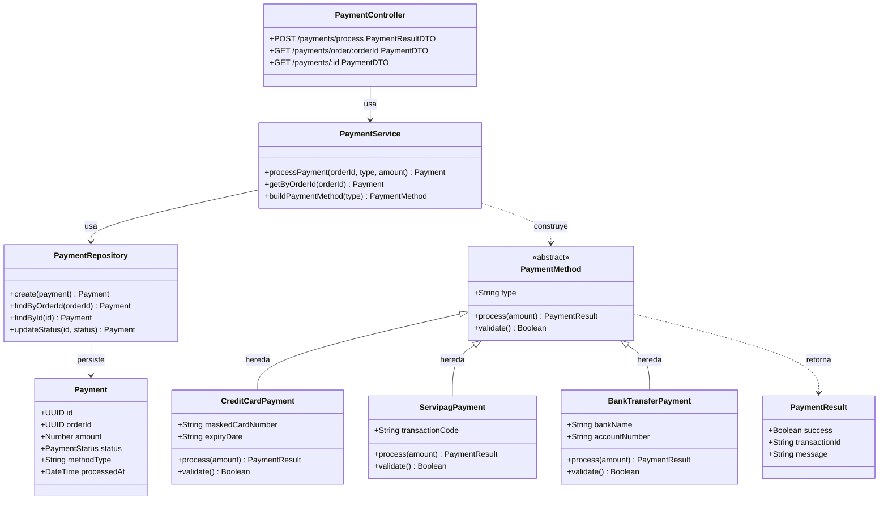

---

### 1.11 Diagrama Interno — notification-service

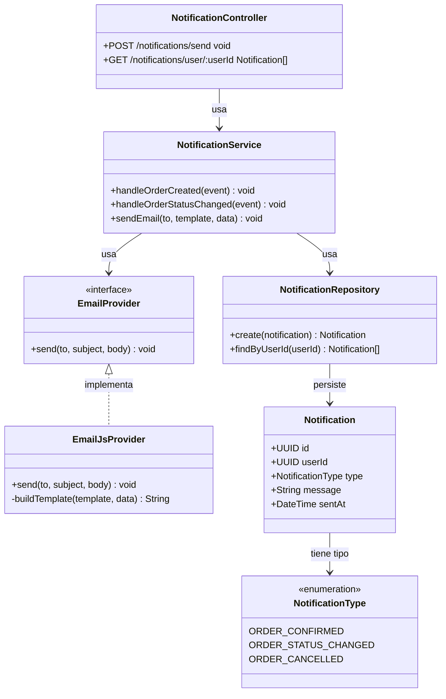

---

### 1.12 Diagrama Interno — report-service

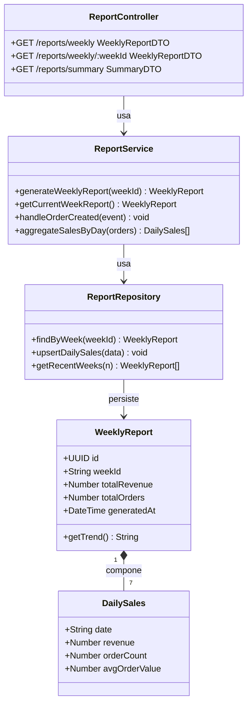

---

## 2. Relaciones, Composición y Herencia

### 2.1 Composición ◆ (rombo relleno)

La composición indica que el objeto contenido **no puede existir sin el contenedor**. Si el contenedor se destruye, el contenido también.

| Relación | Justificación |
|---|---|
| `Order` ◆── `OrderItem` | Un `OrderItem` no tiene sentido sin el pedido al que pertenece. Si el pedido se elimina, sus ítems desaparecen en cascada. |
| `Cart` ◆── `CartItem` | El ítem del carrito es una entidad efímera que depende completamente del carrito. No existe de forma independiente. |
| `WeeklyReport` ◆── `DailySales` | Los datos diarios son parte constitutiva del reporte semanal; no tienen propósito fuera de él. |

### 2.2 Agregación ◇ (rombo vacío)

La agregación indica que el objeto contenido **puede existir independientemente**, pero conceptualmente "pertenece" al contenedor.

| Relación | Justificación |
|---|---|
| `User` ◇── `SavedAddress` | Las direcciones son entidades con ciclo de vida propio: se crean, editan y eliminan de forma independiente. El usuario puede tener cero o varias. No se destruyen al mismo tiempo que el usuario, sino que se gestionan separadamente. |

### 2.3 Herencia / Generalización ◁

La herencia se usa cuando existe una **jerarquía de tipos** con comportamiento compartido y especializaciones.

| Relación | Justificación |
|---|---|
| `PaymentMethod` ◁── `CreditCardPayment` | Comparte el contrato (`process()`, `validate()`) pero implementa la lógica específica de tarjeta. |
| `PaymentMethod` ◁── `ServipagPayment` | Misma interfaz, lógica de integración con Servipag. |
| `PaymentMethod` ◁── `BankTransferPayment` | Misma interfaz, lógica específica para transferencia bancaria. |

### 2.4 Realización (Interfaz) ◁ (línea punteada)

| Relación | Justificación |
|---|---|
| `EmailProvider` ◁.. `EmailJsProvider` | `EmailProvider` define el contrato de envío de correos. `EmailJsProvider` es la implementación concreta actual. En el futuro se podría cambiar a SendGrid sin modificar `NotificationService`. |

### 2.5 Asociación →

| Relación | Justificación |
|---|---|
| `Product` → `Category` | Un producto pertenece a una categoría, pero la categoría existe de forma completamente independiente. |
| `Payment` → `PaymentMethod` | El pago usa un método de pago durante su procesamiento, pero no lo posee como entidad. |
| `Order` → `OrderStatus` | La enumeración describe el estado del pedido sin ser parte constitutiva de él. |

### 2.6 Impacto de las relaciones en el acoplamiento

- **La composición** mantiene la lógica interna de cada servicio (OrderItem vive solo dentro de order-service), evitando que otros servicios dependan de esa estructura.
- **La herencia en PaymentMethod** permite que `PaymentService` trabaje con cualquier método de pago mediante polimorfismo, sin acoplar el código a un tipo específico.
- **La asociación por ID** (OrderItem guarda `productId` como UUID, no una referencia al objeto Product) elimina el acoplamiento directo entre `order-service` y `product-service`.

---

## 3. Separación de Responsabilidades

### 3.1 Responsabilidades por microservicio

| Microservicio | Responsabilidades asignadas | Responsabilidades excluidas |
|---|---|---|
| `auth-service` | Login, registro, emisión de JWT, validación de tokens, hash de contraseñas | Gestión del perfil de usuario, gestión de direcciones |
| `user-service` | Consultar y actualizar perfil, gestionar direcciones de despacho | Autenticación, pedidos, pagos |
| `product-service` | Catálogo de productos, gestión de categorías, disponibilidad de productos | Stock/inventario numérico, precios históricos de pedidos |
| `cart-service` | Estado temporal del carrito, agregar/quitar ítems, calcular total | Confirmación de pedidos, procesamiento de pagos |
| `order-service` | Crear pedidos, gestionar ciclo de vida y transiciones de estado (cajero/despachador) | Procesar el pago directamente, enviar emails |
| `payment-service` | Procesar pagos con distintos métodos (tarjeta, Servipag, transferencia), registrar el resultado | Crear o modificar pedidos |
| `notification-service` | Enviar emails de confirmación y actualización de estado, registrar notificaciones | Lógica de negocio de pedidos o pagos |
| `report-service` | Agregar datos de ventas por día/semana, generar reportes para el admin | Operaciones en tiempo real de pedidos o usuarios |

### 3.2 Por qué cada responsabilidad pertenece a su servicio

- **La validación de stock** no está en `product-service` porque la disponibilidad de un producto (campo `available: boolean`) es suficiente para el dominio de Fukusuke. No existe inventario numérico en este contexto.
- **Los reportes** no están en `order-service` porque la analítica tiene ciclos de actualización distintos (por semana) y no debe afectar la disponibilidad del servicio operacional.
- **El ciclo de vida del pedido** (cajero confirma pago, despachador actualiza entrega) está en `order-service` porque es parte del mismo dominio, con roles distintos accediendo al mismo recurso mediante permisos.

---

## 4. Estructura de Microservicio

### 4.1 Patrón seleccionado — Arquitectura en Capas (4 niveles)

```
┌──────────────────────────────────────────────┐
│  Controller / API Layer                      │
│  Recibe requests HTTP, valida DTOs,          │
│  delega a Service, retorna respuestas JSON   │
├──────────────────────────────────────────────┤
│  Service / Business Logic                    │
│  Aplica reglas de negocio, orquesta         │
│  repositorios, emite eventos                 │
├──────────────────────────────────────────────┤
│  Repository / Data Access                    │
│  Abstrae las consultas a la base de datos,   │
│  devuelve entidades de dominio               │
├──────────────────────────────────────────────┤
│  Model / Entity                              │
│  Define la estructura del dominio:           │
│  atributos, tipos y métodos de cálculo       │
└──────────────────────────────────────────────┘
```

### 4.2 Ejemplo aplicado — order-service

- **`OrderController`**: expone endpoints REST (`POST /orders`, `PATCH /orders/:id/status`), valida el JWT, parsea el body, responde con HTTP 200/201/404.
- **`OrderService`**: implementa la máquina de estados, valida transiciones (`PENDIENTE → PAGADO → PREPARANDO → EN_CAMINO → ENTREGADO`), emite eventos al bus.
- **`OrderRepository`**: ejecuta queries SQL `INSERT`, `UPDATE`, `SELECT`, abstrae la BD del servicio.
- **`Order` / `OrderItem`**: entidades del dominio con sus atributos y el método `getSubtotal()`.

### 4.3 Alternativas descartadas

| Alternativa | Razón del descarte |
|---|---|
| Arquitectura sin Repository (Service accede a BD directo) | Dificulta los tests unitarios y acopla la lógica de negocio al motor de base de datos. |
| Arquitectura hexagonal completa (puertos y adaptadores) | Agrega complejidad innecesaria para el alcance del proyecto. La arquitectura en capas cumple los requisitos. |
| Monolito modular (módulos internos en lugar de servicios) | No permite despliegue independiente ni escalado granular. |

### 4.4 Por qué esta estructura facilita mantenimiento y evolución

- Cambiar el motor de base de datos solo afecta la capa Repository.
- Agregar un nuevo endpoint solo afecta el Controller.
- Las reglas de negocio están concentradas en el Service, fáciles de encontrar y modificar.
- Los tests unitarios prueban el Service aislando el Repository con mocks.

---

## 5. Alta Cohesión de Microservicios

### 5.1 Análisis de cohesión por servicio

| Microservicio | Todas sus clases sirven para... |
|---|---|
| `auth-service` | Autenticar: `AuthController`, `AuthService`, `AuthRepository`, `User`, `JwtToken`, `LoginDTO`, `RegisterDTO`. Cada clase resuelve un aspecto de la autenticación. |
| `payment-service` | Procesar pagos: `PaymentController`, `PaymentService`, `PaymentRepository`, `Payment`, `PaymentMethod`, `CreditCardPayment`, `ServipagPayment`, `BankTransferPayment`, `PaymentResult`. Todas giran en torno al proceso de cobro. |
| `order-service` | Gestionar pedidos: `OrderController`, `OrderService`, `OrderRepository`, `Order`, `OrderItem`, `OrderStatus`. Cada clase representa un aspecto del ciclo de vida del pedido. |
| `notification-service` | Notificar: `NotificationController`, `NotificationService`, `NotificationRepository`, `EmailProvider`, `EmailJsProvider`, `Notification`, `NotificationType`. Todas orientadas al envío de mensajes externos. |
| `report-service` | Reportar ventas: `ReportController`, `ReportService`, `ReportRepository`, `WeeklyReport`, `DailySales`. Solo contiene lo necesario para la analítica semanal. |

### 5.2 Clases movidas o descartadas para mejorar cohesión

| Clase / función | Dónde podría haber estado | Dónde está | Razón |
|---|---|---|---|
| `SavedAddress` | `auth-service` (junto al User) | `user-service` | Las direcciones son información del perfil, no de autenticación. Mezclarlas reduciría la cohesión de ambos servicios. |
| `OrderItem` | `product-service` (como ítem del catálogo) | `order-service` | Representa el precio histórico en el momento de la compra, no el precio actual del catálogo. |
| Lógica de reportes | `order-service` (como módulo de estadísticas) | `report-service` | La analítica tiene ciclos de vida distintos a las operaciones de pedidos. Separarla mantiene alta cohesión en `order-service`. |
| `EmailProvider` / `EmailJsProvider` | `order-service` | `notification-service` | El envío de correos no es parte del ciclo de vida del pedido, sino una reacción a él. |

---

## 6. Bajo Acoplamiento de Microservicios

### 6.1 Estrategias de desacoplamiento aplicadas

| Estrategia | Aplicación en Fukusuke |
|---|---|
| **Database per Service** | Cada microservicio tiene su propia base de datos. Ningún servicio accede directamente a la BD de otro. |
| **Comunicación por ID** | `OrderItem` guarda `productId` (UUID), no una referencia al objeto `Product`. `Order` guarda `userId`, no el objeto `User`. |
| **Comunicación síncrona (REST)** | Solo cuando se necesita respuesta inmediata: `order-service` → `payment-service` (el pago debe confirmarse antes de continuar). |
| **Comunicación asíncrona (eventos)** | Para operaciones sin dependencia temporal: `order-service` emite `order.created` y `order.status_changed`; `notification-service` y `report-service` consumen los eventos. |
| **Contratos de API (DTOs)** | Cada servicio expone solo DTOs en sus respuestas HTTP, nunca sus entidades internas. Los contratos son estables aunque la implementación interna cambie. |

### 6.2 Diagrama de dependencias entre servicios

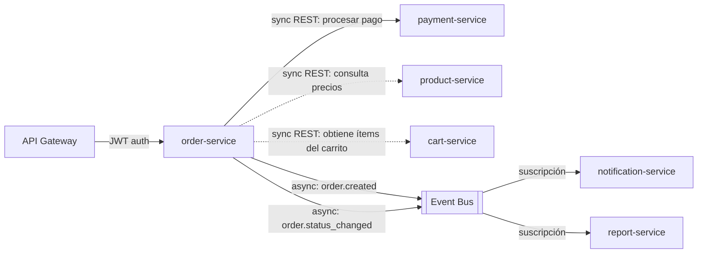

**Leyenda:** `→` dependencia síncrona (bloqueante), `-.->` consulta de solo lectura, `-->` evento asíncrono.

### 6.3 Dependencias permitidas y justificación

| Dependencia | Tipo | Justificación |
|---|---|---|
| `order-service` → `payment-service` | Sync REST | El resultado del pago determina si el pedido avanza a estado `PAGADO`. Es necesaria la respuesta inmediata. |
| `order-service` → `product-service` | Sync REST (solo lectura) | Al crear el pedido se consulta el precio actual del producto para registrarlo en `OrderItem`. Solo ocurre una vez al crear. |
| `order-service` → `cart-service` | Sync REST (solo lectura) | Para obtener los ítems y total del carrito al crear el pedido. Luego el carrito se vacía. |

### 6.4 Dependencias descartadas y justificación

| Dependencia descartada | Razón |
|---|---|
| `payment-service` → `order-service` | El servicio de pago no debe conocer la lógica de pedidos. Solo procesa montos y registra resultados. |
| `notification-service` → `order-service` (consulta directa) | Aumentaría el acoplamiento temporal. Si `order-service` falla, `notification-service` también fallaría. Con eventos asíncronos esto se evita. |
| `report-service` → `order-service` (acceso directo a BD) | La BD de pedidos es privada de `order-service`. Los reportes se construyen con datos del bus de eventos, sin acceso a la BD operacional. |
| Shared database (BD compartida entre servicios) | Crea acoplamiento estructural: cambiar el esquema de un servicio afecta a todos. |

---

## 7. Justificaciones Arquitectónicas

### Decisión 1 — Arquitectura general: microservicios vs. monolito

**Decisión arquitectónica:** Definir la arquitectura general del backend de Fukusuke.

**Alternativa A:** Construir un monolito en Node.js/Express con módulos internos separados por dominio.

**Descarte:** Se descarta porque, aunque es más simple de desarrollar inicialmente, no permite escalar de forma independiente los servicios con mayor carga (el catálogo de productos recibe muchas más consultas que el módulo de reportes). Un fallo en el módulo de notificaciones derribaría toda la aplicación. Además, un cambio en el módulo de pagos requiere redeploy completo, aumentando el riesgo operacional.

**Alternativa B:** Arquitectura de microservicios con servicios independientes por dominio.

**Selección:** Se selecciona la Alternativa B.

**Justificación:** Permite escalar `product-service` de forma independiente sin afectar `payment-service`. Mejora el aislamiento de fallos: si `notification-service` cae, los pedidos siguen procesándose. Cada servicio puede desplegarse, monitorearse y evolucionar de forma autónoma, mejorando la mantenibilidad y escalabilidad del sistema completo.

---

### Decisión 2 — Separar auth-service de user-service

**Decisión arquitectónica:** División del manejo de usuarios en Fukusuke.

**Alternativa A:** Un único servicio (`user-auth-service`) que maneje tanto autenticación como perfil de usuario y direcciones.

**Descarte:** Se descarta porque mezcla responsabilidades con ciclos de cambio distintos. La autenticación es transversal (todos los demás servicios necesitan validar tokens), mientras que el perfil de usuario es una funcionalidad específica de negocio. Un cambio en cómo se almacenan las direcciones de despacho no debería afectar la lógica de validación JWT.

**Alternativa B:** Dos servicios independientes: `auth-service` (tokens, login, roles) y `user-service` (perfil, direcciones).

**Selección:** Se selecciona la Alternativa B.

**Justificación:** Mejora la cohesión de ambos servicios: cada uno contiene solo lo relacionado a su propósito. Reduce el acoplamiento: el `auth-service` puede desplegarse con alta disponibilidad sin depender del `user-service`. Si en el futuro Fukusuke integra otra aplicación, puede reutilizar `auth-service` de forma aislada.

---

### Decisión 3 — Separar product-service de cart-service

**Decisión arquitectónica:** Gestión del catálogo y del carrito de compras.

**Alternativa A:** Un único servicio que gestione tanto el catálogo de productos como el estado del carrito.

**Descarte:** Se descarta porque el catálogo es un recurso de lectura intensiva y relativamente estático (muchos usuarios consultando el menú simultáneamente), mientras que el carrito es un estado efímero y mutable por usuario. Sus patrones de acceso, escalado y tecnología de almacenamiento óptima son distintos.

**Alternativa B:** `product-service` para el catálogo y `cart-service` para el carrito.

**Selección:** Se selecciona la Alternativa B.

**Justificación:** Permite cachear agresivamente el catálogo sin afectar el carrito. El `cart-service` puede usar Redis (almacenamiento en memoria) para mayor velocidad, mientras el `product-service` usa una base de datos relacional para consistencia. La alta cohesión de cada servicio facilita su mantenimiento independiente.

---

### Decisión 4 — Separar order-service de payment-service

**Decisión arquitectónica:** División entre gestión de pedidos y procesamiento de pagos.

**Alternativa A:** El `order-service` procesa los pagos directamente como parte de la creación del pedido.

**Descarte:** Se descarta porque la lógica de pago es compleja, sensible a cambios regulatorios y evoluciona con frecuencia (nuevos medios de pago como Webpay Plus, billeteras digitales). Mezclarla con la lógica de pedidos aumenta el acoplamiento, dificulta agregar nuevos métodos y aumenta el riesgo de que un bug en pagos afecte la gestión de pedidos.

**Alternativa B:** `payment-service` independiente, con el patrón Strategy implementado mediante herencia en `PaymentMethod`.

**Selección:** Se selecciona la Alternativa B.

**Justificación:** Permite agregar un nuevo método de pago (ej: Webpay Plus) como una nueva subclase de `PaymentMethod` sin modificar `order-service`. El patrón Strategy garantiza alta cohesión: cada clase concreta encapsula solo la lógica de su método de pago. Reduce el acoplamiento entre el ciclo de vida del pedido y el procesamiento financiero.

---

### Decisión 5 — Herencia en PaymentMethod vs. composición con objeto genérico

**Decisión arquitectónica:** Estructura interna para manejar múltiples métodos de pago.

**Alternativa A:** Usar composición: `Payment` contiene un campo `methodData: object` genérico con los detalles del método.

**Descarte:** Se descarta porque pierde el beneficio del tipado estático y el polimorfismo. Validar un pago con tarjeta requiere lógica diferente a validar una transferencia bancaria; con un objeto genérico, esa lógica quedaría concentrada en if/else dentro de `PaymentService`, reduciendo su cohesión y dificultando agregar nuevos métodos.

**Alternativa B:** Usar herencia — `PaymentMethod` es abstracta; `CreditCardPayment`, `ServipagPayment` y `BankTransferPayment` heredan e implementan `process()` y `validate()`.

**Selección:** Se selecciona la Alternativa B.

**Justificación:** El polimorfismo permite que `PaymentService.processPayment()` llame a `method.process(amount)` sin conocer el tipo concreto (Principio de Sustitución de Liskov). Agregar un nuevo método de pago es añadir una nueva subclase sin modificar código existente (Principio Open/Closed). Mejora la cohesión: cada subclase contiene exclusivamente la lógica relevante para su método. Reduce el acoplamiento de `PaymentService` respecto a las implementaciones concretas.

---

### Decisión 6 — OrderItem copia datos del producto vs. referencia directa

**Decisión arquitectónica:** Cómo `OrderItem` accede a la información del producto.

**Alternativa A:** `OrderItem` contiene una referencia directa al `Product` mediante FK o llamada síncrona a `product-service` en cada consulta.

**Descarte:** Se descarta porque si el precio de un producto cambia en el catálogo, los pedidos históricos mostrarían precios incorrectos. Además, crea acoplamiento fuerte en tiempo de ejecución: consultar un pedido antiguo requeriría que `product-service` esté disponible, afectando la independencia de `order-service`.

**Alternativa B:** `OrderItem` copia los datos relevantes del producto en el momento de la compra: `productId`, `productName`, `unitPrice`.

**Selección:** Se selecciona la Alternativa B.

**Justificación:** Los pedidos históricos conservan el precio exacto pagado, lo cual es correcto desde la perspectiva del negocio y cumplimiento (boletas, facturas). Reduce el acoplamiento: `order-service` puede responder consultas de pedidos antiguos sin depender de `product-service`. La composición `Order` ◆── `OrderItem` refleja que los ítems son parte inseparable del pedido y tienen ciclo de vida conjunto.

---

### Decisión 7 — Comunicación asíncrona para notificaciones y reportes

**Decisión arquitectónica:** Cómo `order-service` comunica eventos a `notification-service` y `report-service`.

**Alternativa A:** Llamadas REST síncronas: cuando se crea un pedido, `order-service` llama directamente a `notification-service` y `report-service` antes de responder al cliente.

**Descarte:** Se descarta porque si `notification-service` falla o tarda, la operación de crear un pedido también fallaría o se ralentizaría, aunque el email de confirmación no es crítico para la transacción principal. Aumenta el acoplamiento temporal: `order-service` debe conocer las URLs de todos los servicios que "reaccionan" a sus eventos.

**Alternativa B:** Bus de eventos asíncrono: `order-service` emite eventos (`order.created`, `order.status_changed`) y los servicios interesados los consumen de forma independiente.

**Selección:** Se selecciona la Alternativa B.

**Justificación:** El pedido se crea exitosamente independientemente del estado del `notification-service`. Reduce el acoplamiento: `order-service` no necesita saber qué servicios están escuchando. Nuevos servicios pueden suscribirse a eventos sin modificar `order-service`, lo que mejora la mantenibilidad (Open/Closed). Aumenta la resiliencia: si `report-service` cae temporalmente, procesará los eventos acumulados al recuperarse.

---

### Decisión 8 — Database per Service vs. base de datos compartida

**Decisión arquitectónica:** Estrategia de persistencia de datos entre microservicios.

**Alternativa A:** Una única base de datos PostgreSQL compartida con esquemas separados por microservicio.

**Descarte:** Se descarta porque, aunque simplifica la operación inicial, crea acoplamiento estructural: cambiar el esquema de tablas de `order-service` puede afectar queries de `payment-service` si comparten la misma BD. Elimina la posibilidad de usar tecnologías de almacenamiento especializadas por servicio. Un problema de rendimiento en la BD afecta a todos los servicios simultáneamente.

**Alternativa B:** Cada microservicio tiene su propia base de datos (patrón Database per Service).

**Selección:** Se selecciona la Alternativa B.

**Justificación:** Garantiza el aislamiento total entre servicios: los esquemas evolucionan de forma independiente sin coordinación entre equipos. El `cart-service` puede usar Redis para máxima velocidad; el `report-service` puede usar almacenamiento columnar para analítica eficiente; los servicios operacionales pueden usar PostgreSQL relacional. Reduce el acoplamiento estructural a cero entre servicios y mejora la escalabilidad al permitir escalar la BD de cada servicio de forma independiente según su carga.
