# Diseño de Microservicios — Fukusuke BackEnd

> Documento actualizado el 2026-06-30. Refleja el código real en la rama `main` (commit base `6ec7f36`, desacople auth↔users).

---

## 0. Descripción Técnica del Backend (código real)

Esta sección documenta el backend tal como está implementado actualmente en el repositorio, incluyendo todas las entidades, endpoints, DTOs, servicios y patrones de diseño reales.

### 0.1 Stack y configuración global

| Aspecto | Valor |
|---|---|
| Framework | NestJS 11 |
| Runtime | Node.js ≥ 20 |
| Base de datos | PostgreSQL vía TypeORM 0.3 |
| Prefijo global | `/api` |
| Documentación | `/docs` (Swagger / OpenAPI) |
| Puerto | `process.env.PORT` o `3000` |
| Validación global | `ValidationPipe({ whitelist: true, transform: true })` |
| CORS | Habilitado para todos los orígenes |

### 0.2 Variables de entorno requeridas

| Variable | Descripción |
|---|---|
| `DATABASE_URL` | URL de conexión a PostgreSQL |
| `JWT_SECRET` | Clave secreta para firmar tokens JWT (default: `fukusuke-secret`) |
| `JWT_EXPIRES_IN` | Duración del token (default: `7d`) |
| `NODE_ENV` | `production` activa SSL y desactiva `synchronize` |

### 0.3 Módulo raíz (`app.module.ts`)

```
AppModule
 ├── ConfigModule (global)
 ├── EventEmitterModule
 ├── TypeOrmModule (async, PostgreSQL, autoLoadEntities, synchronize en dev, SSL en prod)
 └── [AuthModule, UsersModule, ProductsModule, CartModule,
      OrdersModule, PaymentsModule, NotificationsModule, ReportsModule]
```

---

### 0.4 Módulo Auth (`src/auth/`)

**Entidades:**

`credentials` — credenciales de acceso

| Campo | Tipo | Descripción |
|---|---|---|
| `id` | uuid PK | Identificador |
| `email` | string unique | Correo electrónico |
| `passwordHash` | string select:false | Hash bcrypt |
| `role` | enum UserRole | Rol del usuario |
| `active` | boolean | Cuenta habilitada |
| `userId` | string | Referencia lógica al `UserProfile.id` |
| `createdAt` | timestamp | Fecha de creación |

**Roles disponibles:** `cliente | admin | cajero | despachador | dueno`

**Endpoints:**

| Método | Ruta | Auth | Descripción |
|---|---|---|---|
| `POST` | `/api/auth/register` | — | Registro; devuelve usuario + JWT |
| `POST` | `/api/auth/login` | — | Login; devuelve usuario + JWT |
| `GET` | `/api/auth/profile` | JWT | Perfil del usuario autenticado |

**JWT payload:** `{ sub: userId, role, email }` — mapeado a `req.user = { id, email, role }`.

**Flujo de registro:** verifica unicidad de email (en `credentials`) y de RUN (delegando en `UsersService.findByRun`) → crea el `UserProfile` **delegando en `UsersService.createProfile`** (auth no toca la tabla `user_profiles`) → hashea contraseña (bcrypt salt 10) → persiste `Credential` → retorna usuario combinado + token. Ver la tensión de atomicidad en Decisión 2.

**Guards y decoradores exportados:** `JwtAuthGuard`, `RolesGuard`, `@Roles(...)`.

---

### 0.5 Módulo Users (`src/users/`)

**Entidades:**

`user_profiles` — datos personales del usuario

| Campo | Tipo | Descripción |
|---|---|---|
| `id` | uuid PK | Compartido con `credentials.userId` |
| `run` | string unique | RUT chileno |
| `fullName` | string | Nombre completo |
| `phone` | string | Teléfono |
| `address` | string | Dirección principal |
| `commune` | string | Comuna |
| `province` | string | Provincia |
| `region` | string | Región |
| `birthDate` | string nullable | Fecha de nacimiento (ISO) |
| `gender` | enum M/F/otro | Género |
| `createdAt` | timestamp | Fecha de creación |

`saved_addresses` — direcciones de despacho guardadas

| Campo | Tipo | Descripción |
|---|---|---|
| `id` | uuid PK | Identificador |
| `userId` | string | Referencia al `UserProfile.id` |
| `label` | string | Etiqueta (ej.: "Casa") |
| `address` | string | Dirección completa |
| `commune` | string | Comuna |
| `createdAt` | timestamp | Fecha de creación |

**Endpoints (todos requieren JWT):**

| Método | Ruta | Descripción |
|---|---|---|
| `GET` | `/api/users/profile` | Perfil del usuario autenticado |
| `PUT` | `/api/users/profile` | Actualiza datos del perfil |
| `GET` | `/api/users/addresses` | Lista direcciones guardadas |
| `POST` | `/api/users/addresses` | Agrega una dirección |
| `DELETE` | `/api/users/addresses/:id` | Elimina una dirección (solo propietario) |

---

### 0.6 Módulo Products (`src/products/`)

**Entidades:**

`categories`

| Campo | Tipo | Descripción |
|---|---|---|
| `id` | uuid PK | Identificador |
| `name` | string unique | Nombre legible (ej.: "Rolls") |
| `slug` | string unique | Identificador URL (ej.: `rolls`) |

Categorías seed: `rolls`, `nigiris`, `temakis`, `combos`, `bebidas`.

`products`

| Campo | Tipo | Descripción |
|---|---|---|
| `id` | uuid PK | Identificador |
| `name` | string | Nombre |
| `description` | text | Descripción |
| `price` | numeric(10,0) | Precio en CLP |
| `available` | boolean | Disponible para venta |
| `featured` | boolean | Producto destacado |
| `imageUrl` | string nullable | URL de imagen |
| `category` | ManyToOne → Category | Categoría (eager) |
| `createdAt` | timestamp | Creación |
| `updatedAt` | timestamp | Última actualización |

**Endpoints:**

| Método | Ruta | Auth / Roles | Descripción |
|---|---|---|---|
| `GET` | `/api/products` | — | Lista todos; acepta `?category=<slug>` |
| `GET` | `/api/products/:id` | — | Detalle de un producto |
| `POST` | `/api/products` | JWT + admin/dueno | Crea un producto |
| `PUT` | `/api/products/:id` | JWT + admin/dueno | Actualiza un producto |
| `PATCH` | `/api/products/:id/availability` | JWT + admin/cajero/dueno | Cambia disponibilidad |

---

### 0.7 Módulo Cart (`src/cart/`)

**Entidades:**

`carts`

| Campo | Tipo | Descripción |
|---|---|---|
| `id` | uuid PK | Identificador |
| `userId` | string unique | Un carrito por usuario |
| `items` | OneToMany → CartItem | Ítems (cascade, eager) |
| `updatedAt` | timestamp | Última modificación |

`cart_items`

| Campo | Tipo | Descripción |
|---|---|---|
| `id` | uuid PK | Identificador |
| `productId` | string | ID del producto |
| `productName` | string | Nombre al momento de agregar |
| `unitPrice` | numeric(10,0) | Precio unitario al momento de agregar |
| `quantity` | int | Cantidad |
| `cart` | ManyToOne → Cart | Carrito padre (cascade delete) |

**Endpoints (todos requieren JWT):**

| Método | Ruta | Descripción |
|---|---|---|
| `GET` | `/api/cart` | Carrito + total calculado |
| `POST` | `/api/cart/items` | Agrega ítem (o incrementa cantidad) |
| `PUT` | `/api/cart/items/:productId` | Actualiza cantidad (quantity ≤ 0 elimina) |
| `DELETE` | `/api/cart/items/:productId` | Elimina un ítem |
| `DELETE` | `/api/cart` | Vacía el carrito |

**Respuesta:** `{ cart: {...}, total: number }`. El total se calcula en memoria en `CartService.calculateTotal()`.

---

### 0.8 Módulo Orders (`src/orders/`)

**Entidades:**

`orders`

| Campo | Tipo | Descripción |
|---|---|---|
| `id` | uuid PK | Identificador |
| `userId` | string | Usuario propietario |
| `status` | enum OrderStatus | Estado actual |
| `total` | numeric(10,0) | Total en CLP |
| `deliveryAddress` | string | Dirección de entrega |
| `paymentMethod` | string nullable | Método de pago |
| `cancelReason` | string nullable | Motivo de anulación |
| `items` | OneToMany → OrderItem | Ítems (cascade, eager) |
| `createdAt` / `updatedAt` | timestamp | Fechas |

`order_items`

| Campo | Tipo | Descripción |
|---|---|---|
| `id` | uuid PK | Identificador |
| `productId` | string | ID del producto |
| `productName` | string | Nombre al momento del pedido |
| `unitPrice` | numeric(10,0) | Precio unitario histórico |
| `quantity` | int | Cantidad |
| `order` | ManyToOne → Order | Pedido padre (cascade delete) |

**Máquina de estados:**

```
pendiente → pagado → preparando → en_camino → entregado
pendiente → anulado
```

| Estado actual | Siguientes permitidos |
|---|---|
| `pendiente` | `pagado`, `anulado` |
| `pagado` | `preparando` |
| `preparando` | `en_camino` |
| `en_camino` | `entregado` |
| `entregado` | _(ninguna)_ |
| `anulado` | _(ninguna)_ |

**Control de roles para cambio de estado:**

| Rol | Puede transicionar a |
|---|---|
| `admin` / `dueno` | Cualquier transición válida |
| `cajero` | `pagado` |
| `despachador` | `en_camino`, `entregado` |

**Endpoints:**

| Método | Ruta | Auth / Roles | Descripción |
|---|---|---|---|
| `POST` | `/api/orders` | JWT | Crea un pedido (opcionalmente lo paga en el mismo request) |
| `GET` | `/api/orders` | JWT + admin/cajero/dueno | Lista todos los pedidos |
| `GET` | `/api/orders/my` | JWT | Pedidos del usuario autenticado |
| `GET` | `/api/orders/:id` | JWT | Detalle de un pedido |
| `PATCH` | `/api/orders/:id/status` | JWT | Cambia estado (con validación de roles y máquina de estados) |
| `DELETE` | `/api/orders/:id` | JWT + admin | Elimina un pedido (solo si está en `pendiente`) |

**Flujo de creación con pago inline:** si `CreateOrderDto` incluye `paymentData`, el servicio crea el pedido en `pendiente`, emite `order.created`, llama a `PaymentsService.processPayment()` y si el resultado es `aprobado` actualiza a `pagado` y emite `order.paid`.

**Eventos emitidos:**

| Evento | Payload | Cuándo |
|---|---|---|
| `order.created` | `{ orderId, userId, total }` | Al crear el pedido |
| `order.paid` | `{ orderId, userId, amount }` | Al pasar a `pagado` |
| `order.status_changed` | `{ orderId, userId, newStatus, previousStatus }` | Cualquier cambio excepto anulación |
| `order.cancelled` | `{ orderId, userId, reason, previousStatus }` | Al anular |

---

### 0.9 Módulo Payments (`src/payments/`)

**Entidades:**

`payments`

| Campo | Tipo | Descripción |
|---|---|---|
| `id` | uuid PK | Identificador |
| `orderId` | string | Referencia al pedido |
| `amount` | numeric(10,0) | Monto cobrado |
| `status` | enum PaymentStatus | `procesando` / `aprobado` / `rechazado` |
| `methodType` | string | `tarjeta` / `servipag` / `transferencia` |
| `transactionId` | string nullable | ID de transacción externo |
| `errorMessage` | string nullable | Mensaje de error si fue rechazado |
| `processedAt` | timestamp | Fecha de procesamiento |

**Strategy Pattern — jerarquía `PaymentMethod`:**

```
PaymentMethod (abstract)
  ├─ CreditCardPayment   (type: 'tarjeta')     — valida cardNumber + expiryDate
  ├─ ServipagPayment     (type: 'servipag')    — valida cardNumber + expiryDate
  └─ BankTransferPayment (type: 'transferencia') — valida bankName + accountNumber
```

Cada estrategia implementa `validate(): boolean` y `process(amount): Promise<PaymentResult>`.

**Flujo:** `buildPaymentMethod(dto)` instancia la estrategia → `validate()` → `process(amount)` → persiste resultado como `Payment`.

**Endpoints:**

| Método | Ruta | Auth | Descripción |
|---|---|---|---|
| `POST` | `/api/payments/process` | JWT | Procesa un pago |
| `GET` | `/api/payments/order/:orderId` | JWT | Pago asociado a un pedido |

---

### 0.10 Módulo Notifications (`src/notifications/`)

**Entidades:**

`notifications`

| Campo | Tipo | Descripción |
|---|---|---|
| `id` | uuid PK | Identificador |
| `userId` | string | Destinatario |
| `type` | enum NotificationType | Tipo de notificación |
| `message` | text | Texto legible |
| `read` | boolean | Leída (default: false) |
| `createdAt` | timestamp | Fecha de creación |

**Tipos:** `order_confirmed` / `order_status_changed` / `order_cancelled`

**Listeners de eventos:**

| Evento | Acción |
|---|---|
| `order.created` | Crea notificación `order_confirmed` |
| `order.status_changed` | Crea notificación `order_status_changed` |
| `order.cancelled` | Crea notificación `order_cancelled` |

**Endpoints (todos requieren JWT):**

| Método | Ruta | Descripción |
|---|---|---|
| `GET` | `/api/notifications` | Últimas 50 notificaciones del usuario |
| `PATCH` | `/api/notifications/read-all` | Marca todas como leídas |
| `PATCH` | `/api/notifications/:id/read` | Marca una como leída |

---

### 0.11 Módulo Reports (`src/reports/`)

**Entidades:**

`weekly_reports`

| Campo | Tipo | Descripción |
|---|---|---|
| `id` | uuid PK | Identificador |
| `weekId` | string unique | ID semana ISO (ej.: `2026-W21`) |
| `totalRevenue` | numeric(12,0) | Ingresos totales de la semana |
| `totalOrders` | int | Cantidad de pedidos |
| `dailySales` | OneToMany → DailySales | Desglose diario (eager) |
| `generatedAt` / `updatedAt` | timestamp | Fechas |

`daily_sales`

| Campo | Tipo | Descripción |
|---|---|---|
| `id` | uuid PK | Identificador |
| `date` | date | Fecha `YYYY-MM-DD` |
| `revenue` | numeric(12,0) | Ingresos del día |
| `orderCount` | int | Pedidos del día |
| `avgOrderValue` | numeric(10,2) | Ticket promedio |
| `weeklyReport` | ManyToOne → WeeklyReport | Reporte padre (cascade delete) |

**Listener:** `order.paid` → `registerSale(amount)` para la fecha actual.

**Flujo `registerSale`:** calcula weekId ISO → busca/crea `WeeklyReport` → busca/crea `DailySales` para esa fecha → actualiza revenue, orderCount, avgOrderValue diarios → actualiza totalRevenue y totalOrders semanales → persiste.

**Endpoints (requieren JWT + admin/dueno):**

| Método | Ruta | Descripción |
|---|---|---|
| `GET` | `/api/reports/current` | Reporte de la semana actual |
| `GET` | `/api/reports/recent?n=4` | Las n semanas más recientes |
| `GET` | `/api/reports/:weekId` | Reporte de una semana específica |
| `POST` | `/api/reports/register-sale` | Registra manualmente una venta |

---

### 0.12 Diagrama de flujo completo de un pedido pagado

```
Cliente
  │
  ├─ POST /api/orders  (con paymentData)
  │    │
  │    ├─ OrdersService.createOrder()
  │    │    ├─ Persiste Order (status: pendiente)
  │    │    ├─ emit('order.created') ──────────────→ NotificationsService
  │    │    │                                              → notificación order_confirmed
  │    │    ├─ PaymentsService.processPayment()
  │    │    │    └─ Strategy.process() → Payment(aprobado)
  │    │    ├─ Order.status = pagado
  │    │    └─ emit('order.paid') ────────────────→ ReportsService
  │    │                                                 → registerSale(amount)
  │    └─ Devuelve Order
```

---

### 0.13 Matriz de acceso por rol

| Endpoint | cliente | cajero | despachador | admin | dueno |
|---|---|---|---|---|---|
| `POST /auth/register` | si | si | si | si | si |
| `POST /auth/login` | si | si | si | si | si |
| `GET /products` | si | si | si | si | si |
| `POST /products` | no | no | no | si | si |
| `PATCH /products/:id/availability` | no | si | no | si | si |
| `POST /orders` | si | si | si | si | si |
| `GET /orders` (todos) | no | si | no | si | si |
| `PATCH /orders/:id/status` → `pagado` | no | si | no | si | si |
| `PATCH /orders/:id/status` → `en_camino`/`entregado` | no | no | si | si | si |
| `DELETE /orders/:id` | no | no | no | si | no |
| `GET /reports/*` | no | no | no | si | si |

---

### 0.14 Stack tecnológico completo

| Tecnología | Versión | Uso |
|---|---|---|
| Node.js | ≥ 20.0.0 | Runtime |
| NestJS | ^11.0.1 | Framework principal |
| TypeORM | ^0.3.28 | ORM |
| PostgreSQL | — | Base de datos |
| `@nestjs/jwt` | ^11.0.2 | Generación y verificación de JWT |
| `passport-jwt` | ^4.0.1 | Estrategia de extracción de token |
| `bcrypt` | ^6.0.0 | Hash de contraseñas |
| `class-validator` | ^0.15.1 | Validación de DTOs |
| `class-transformer` | ^0.5.1 | Transformación de DTOs |
| `@nestjs/event-emitter` | ^3.1.0 | Comunicación asíncrona entre módulos |
| `@nestjs/swagger` | ^11.4.4 | Documentación OpenAPI |
| TypeScript | ^5.7.3 | Lenguaje |
| Jest | ^30.0.0 | Testing unitario |

---

## 1. Diagrama de Clases con los Microservicios

### 1.1 Microservicios Identificados

Para el backend de Fukusuke se definieron 8 microservicios, cada uno con una responsabilidad única y bien delimitada. En la implementación actual todos corren como módulos dentro del mismo proceso NestJS, lo que permite verificar el funcionamiento de forma sencilla sin perder la separación lógica propia de una arquitectura de microservicios real.

| Microservicio | Responsabilidad única |
|---|---|
| `auth-service` | Autenticación, registro de usuarios y emisión de tokens JWT |
| `user-service` | Gestión del perfil de usuario y direcciones de despacho guardadas |
| `product-service` | Catálogo de productos y categorías del menú |
| `cart-service` | Estado temporal del carrito de compras por usuario |
| `order-service` | Ciclo de vida completo del pedido y transiciones de estado |
| `payment-service` | Procesamiento de pagos según el método elegido |
| `notification-service` | Registro y envío de notificaciones al usuario |
| `report-service` | Generación de reportes semanales de ventas para el administrador |

---

### 1.2 Vista General de la Arquitectura

El siguiente diagrama muestra cómo se comunican los microservicios entre sí y con el cliente. Se distinguen dos tipos de comunicación: sincrónica (REST, cuando se necesita respuesta inmediata) y asincrónica (eventos, cuando no es crítico esperar).

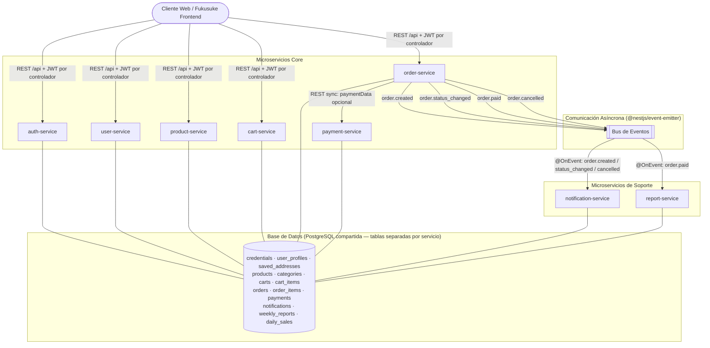

> **Nota sobre el API Gateway:** El diagrama **no dibuja un componente "API Gateway"** porque en esta implementación no existe ninguno desplegado. El rol de gateway lo cumple, de forma puramente lógica, el **prefijo global `/api`** de NestJS más el **`JwtAuthGuard` aplicado por controlador**: el cliente llama directamente a cada microservicio (módulo) por su ruta `/api/...` y la validación del JWT ocurre en el guard de cada controlador. Un despliegue distribuido real sí requeriría un gateway dedicado (NGINX, Kong, Traefik), lo que queda documentado como evolución futura.

> **Nota sobre la base de datos:** Todos los módulos comparten una conexión PostgreSQL única. La separación es real a nivel de tablas: cada módulo registra sus propias entidades vía `TypeOrmModule.forFeature([...])` y ningún servicio consulta tablas de otro módulo. La estrategia Database per Service se aplica como separación lógica.

---

### 1.3 Diagrama de Clases del Dominio

Este diagrama muestra todas las clases principales del sistema, sus atributos, métodos y las relaciones entre ellas. Cada microservicio se dibuja como un **boundary visual** mediante un `namespace` de Mermaid, de modo que se vea con claridad qué clases pertenecen a cada uno de los 8 servicios. Las relaciones entre servicios se representan mediante IDs (UUID) para evitar dependencias directas entre módulos.

```mermaid
classDiagram
    namespace auth-service {
        class Credential {
            +UUID id
            +String email
            +String passwordHash
            +UserRole role
            +Boolean active
            +UUID userId
            +Date createdAt
        }
        class UserRole {
            <<enumeration>>
            CLIENTE
            ADMIN
            CAJERO
            DESPACHADOR
            DUENO
        }
    }

    namespace user-service {
        class UserProfile {
            +UUID id
            +String run
            +String fullName
            +String phone
            +String address
            +String commune
            +String province
            +String region
            +String birthDate
            +UserGender gender
            +Date createdAt
        }
        class UserGender {
            <<enumeration>>
            M
            F
            OTRO
        }
        class SavedAddress {
            +UUID id
            +UUID userId
            +String label
            +String address
            +String commune
            +Date createdAt
        }
    }

    namespace product-service {
        class Product {
            +UUID id
            +String name
            +String description
            +Number price
            +Boolean available
            +Boolean featured
            +String imageUrl
            +Date createdAt
        }
        class Category {
            +UUID id
            +String name
            +String slug
        }
    }

    namespace cart-service {
        class Cart {
            +UUID id
            +UUID userId
            +Date updatedAt
        }
        class CartItem {
            +UUID id
            +UUID productId
            +String productName
            +Number quantity
            +Number unitPrice
            +getSubtotal() Number
        }
    }

    namespace order-service {
        class Order {
            +UUID id
            +UUID userId
            +OrderStatus status
            +Number total
            +String deliveryAddress
            +String paymentMethod
            +String cancelReason
            +Date createdAt
        }
        class OrderStatus {
            <<enumeration>>
            PENDIENTE
            PAGADO
            PREPARANDO
            EN_CAMINO
            ENTREGADO
            ANULADO
        }
        class OrderItem {
            +UUID id
            +UUID productId
            +String productName
            +Number quantity
            +Number unitPrice
            +getSubtotal() Number
        }
    }

    namespace payment-service {
        class PaymentMethod {
            <<abstract>>
            +String type
            +process(amount) PaymentResult
            +validate() Boolean
        }
        class CreditCardPayment {
            +String maskedCardNumber
            +String expiryDate
            +process(amount) PaymentResult
            +validate() Boolean
        }
        class ServipagPayment {
            +String transactionCode
            +process(amount) PaymentResult
            +validate() Boolean
        }
        class BankTransferPayment {
            +String bankName
            +String accountNumber
            +process(amount) PaymentResult
            +validate() Boolean
        }
        class Payment {
            +UUID id
            +UUID orderId
            +Number amount
            +PaymentStatus status
            +String methodType
            +String transactionId
            +Date processedAt
        }
    }

    namespace notification-service {
        class Notification {
            +UUID id
            +UUID userId
            +NotificationType type
            +String message
            +Boolean read
            +Date createdAt
        }
    }

    namespace report-service {
        class WeeklyReport {
            +UUID id
            +String weekId
            +Number totalRevenue
            +Number totalOrders
            +Date updatedAt
        }
        class DailySales {
            +UUID id
            +String date
            +Number revenue
            +Number orderCount
            +Number avgOrderValue
        }
    }

    Credential "1" --> "1" UserRole : tiene rol
    Credential "1" --> "1" UserProfile : referencia lógica por userId
    UserProfile "1" --> "1" UserGender : tiene género
    UserProfile "1" o-- "0..*" SavedAddress : agrega
    Product "1" --> "1" Category : pertenece a
    Cart "1" *-- "1..*" CartItem : compone
    Order "1" *-- "1..*" OrderItem : compone
    Order "1" --> "1" OrderStatus : tiene estado
    Payment "1" --> "1" PaymentMethod : usa
    PaymentMethod <|-- CreditCardPayment : hereda
    PaymentMethod <|-- ServipagPayment : hereda
    PaymentMethod <|-- BankTransferPayment : hereda
    WeeklyReport "1" *-- "7" DailySales : compone
```

---

### 1.4 Estructura Interna — Patrón Aplicado a Todos los Microservicios

Cada microservicio aplica el mismo patrón de arquitectura en cuatro capas. Esto permite separar claramente las responsabilidades dentro de cada módulo:

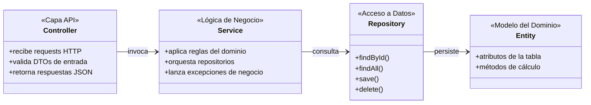

> **Nota sobre la capa Repository:** En la implementación, el rol Repository lo cumple el `Repository<Entity>` genérico de TypeORM, inyectado mediante `@InjectRepository(Entity)`. Los nombres `ProductRepository`, `OrderRepository`, etc., en los diagramas internos representan ese rol arquitectónico, no una clase custom. Algunos diagramas omiten esta capa por claridad y muestran la relación directa entre el Service y la entidad.

---

### 1.5 Diagrama Interno — auth-service

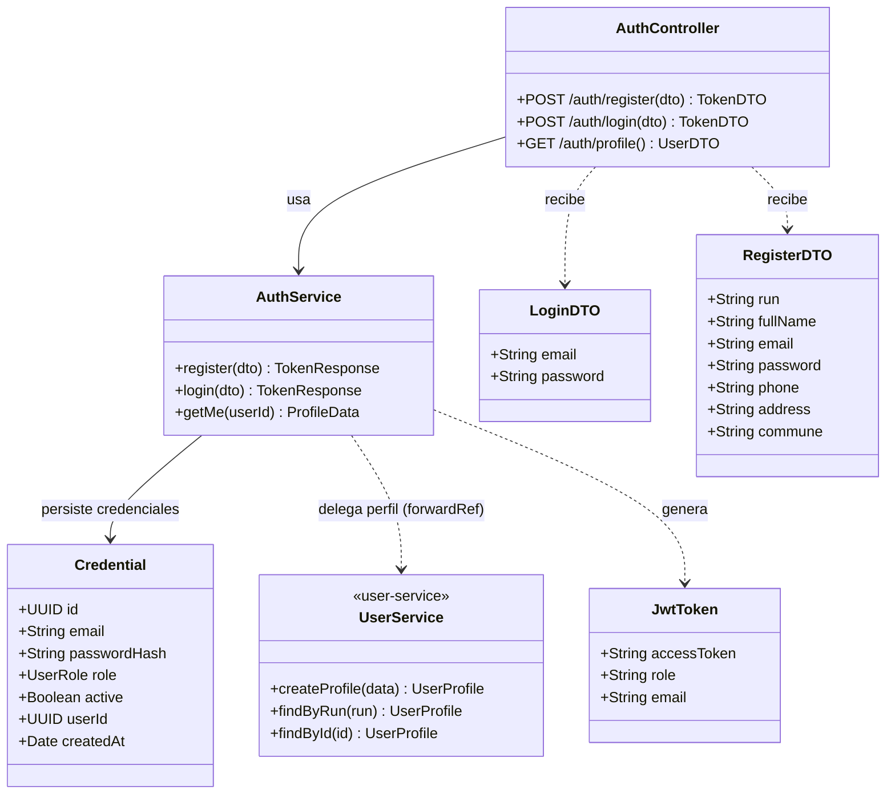

---

### 1.6 Diagrama Interno — user-service

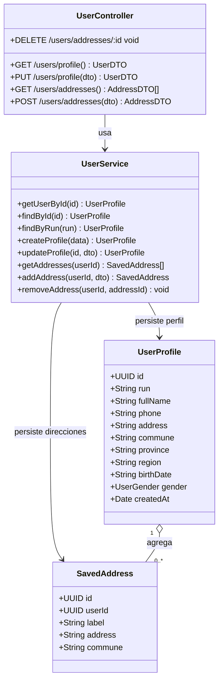

---

### 1.7 Diagrama Interno — product-service

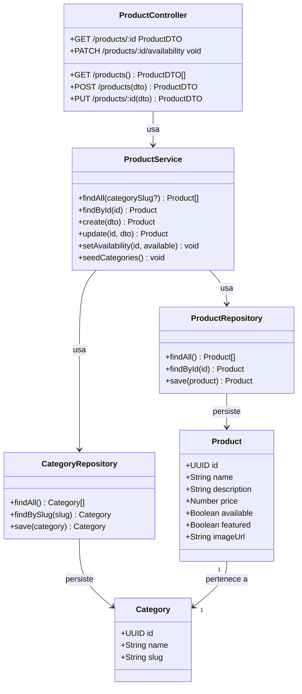

---

### 1.8 Diagrama Interno — cart-service

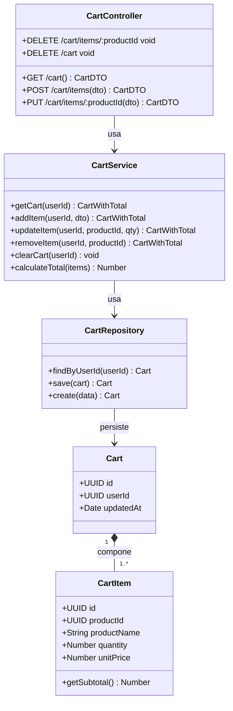

---

### 1.9 Diagrama Interno — order-service

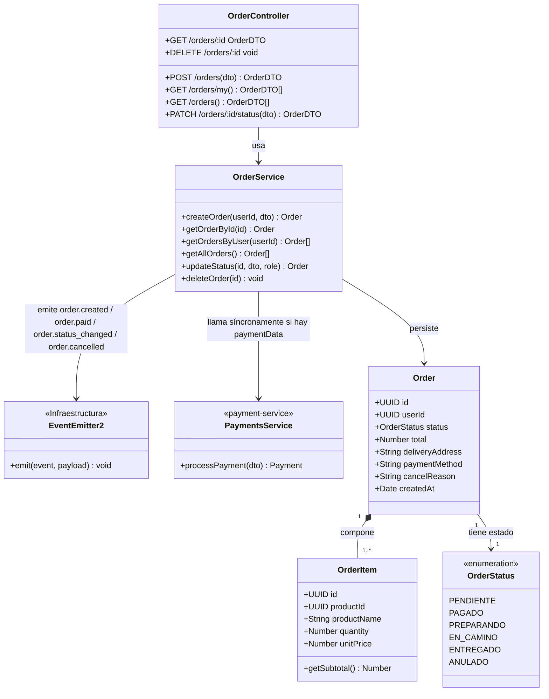

---

### 1.10 Diagrama Interno — payment-service

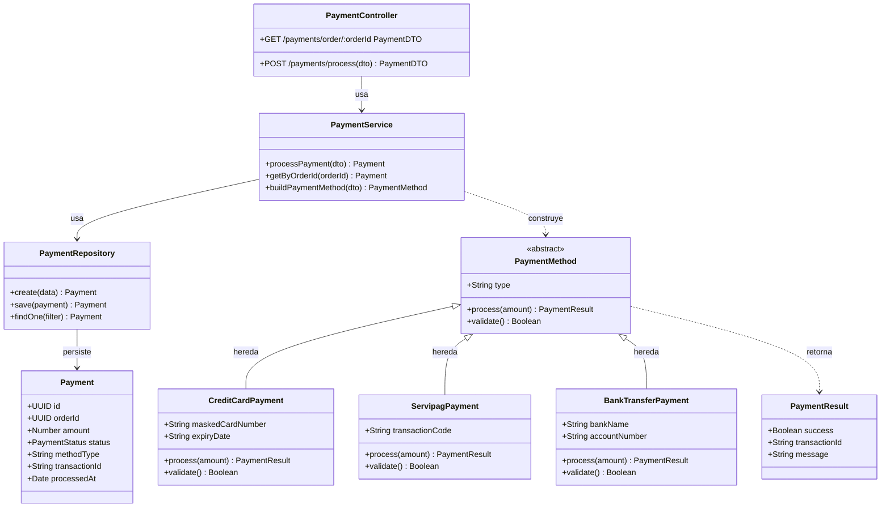

---

### 1.11 Diagrama Interno — notification-service

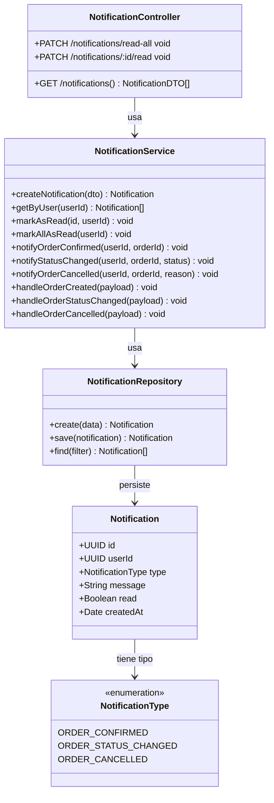

---

### 1.12 Diagrama Interno — report-service

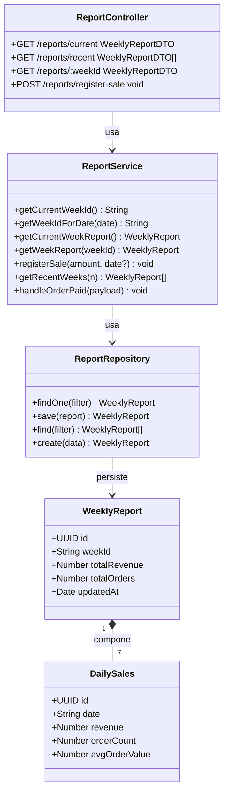

---

## 2. Relaciones, Composición y Herencia

### 2.1 Composición ◆ (rombo relleno)

La composición se usa cuando el objeto "hijo" no tiene razón de existir por sí solo: su ciclo de vida está completamente atado al del "padre". Si el padre se elimina, el hijo también desaparece.

| Relación | Justificación |
|---|---|
| `Order` ◆── `OrderItem` | Un ítem de pedido no tiene ningún sentido sin el pedido al que pertenece. El precio que guarda es el precio histórico de esa compra, no un dato reutilizable. Si el pedido se borra, sus ítems también. |
| `Cart` ◆── `CartItem` | El ítem del carrito es parte del carrito: no existe de forma independiente y se elimina en cascada cuando el carrito se vacía. |
| `WeeklyReport` ◆── `DailySales` | Los datos de ventas diarias existen para construir el reporte semanal. No tienen utilidad fuera de ese contexto. |

### 2.2 Agregación ◇ (rombo vacío)

La agregación se usa cuando el objeto "hijo" puede existir de manera independiente, pero conceptualmente está asociado al "padre". Se pueden agregar o quitar hijos sin destruir al padre.

| Relación | Justificación |
|---|---|
| `UserProfile` ◇── `SavedAddress` | Las direcciones de despacho son entidades con vida propia: el usuario puede agregar, editar o eliminar cada una por separado. El usuario puede tener cero o varias, y estas se gestionan de forma independiente. La asociación se implementa mediante el campo `userId` (UUID) en `SavedAddress`, sin clave foránea TypeORM, para mantener la independencia entre módulos. |

### 2.3 Herencia ◁

La herencia se aplica cuando existe una familia de tipos que comparten un contrato (interfaz), pero cada uno tiene un comportamiento específico distinto.

| Relación | Justificación |
|---|---|
| `PaymentMethod` ◁── `CreditCardPayment` | Comparte los métodos `process()` y `validate()`, pero la lógica de cobrar con tarjeta es propia de esta clase. |
| `PaymentMethod` ◁── `ServipagPayment` | Misma estructura, pero con la lógica de integración de Servipag. |
| `PaymentMethod` ◁── `BankTransferPayment` | Mismo contrato, pero valida número de cuenta y banco, no datos de tarjeta. |

### 2.4 Asociación →

La asociación se usa cuando una clase referencia a otra, pero sin ninguna relación de propiedad o ciclo de vida compartido.

| Relación | Justificación |
|---|---|
| `Product` → `Category` | Un producto pertenece a una categoría, pero la categoría existe de forma completamente independiente y puede tener muchos productos. |
| `Order` → `OrderStatus` | `OrderStatus` es una enumeración que describe el estado del pedido. No es una entidad que "pertenezca" al pedido, simplemente lo describe. |
| `Payment` → `PaymentMethod` | El pago utiliza un método de pago para procesarse, pero no lo posee: el método de pago es una clase de comportamiento, no una entidad persistida. |

### 2.5 Relaciones descartadas y por qué

| Relación descartada | Alternativa elegida | Razón del descarte |
|---|---|---|
| `OrderItem` con referencia directa a `Product` | `OrderItem` guarda `productId`, `productName` y `unitPrice` como copia | Si `OrderItem` apuntara al `Product` actual, al cambiar el precio del menú los pedidos históricos mostrarían datos incorrectos. También crearía una dependencia en tiempo de ejecución entre `order-service` y `product-service`. |
| `Order` con referencia directa a `User` | `Order` guarda solo `userId` (UUID) | No es necesario traer el objeto completo del usuario para gestionar un pedido. Guardar solo el ID mantiene el acoplamiento bajo entre módulos. |
| Herencia entre `Cart` y `Order` | Sin relación de herencia entre ellos | Aunque ambos agrupan ítems, son entidades de dominios distintos: el carrito es efímero y mutable, el pedido es permanente e inmutable. No comparten comportamiento. |
| `DailySales` como entidad independiente | Composición dentro de `WeeklyReport` | Los datos diarios solo tienen significado dentro de un reporte semanal. Hacerlos independientes habría complicado la estructura sin ningún beneficio real. |

### 2.6 Impacto de las relaciones en el acoplamiento

- La **composición** en `Order ◆── OrderItem` y `Cart ◆── CartItem` hace que cada módulo maneje sus propias estructuras de datos internas. Ningún otro servicio necesita conocer la existencia de `OrderItem` o `CartItem`.
- La **herencia en PaymentMethod** permite que `PaymentService` trabaje con cualquier método de pago usando polimorfismo, sin necesitar un `if/else` que dependa del tipo concreto. Agregar un nuevo medio de pago no requiere modificar código existente.
- Las **asociaciones por ID** (UUID) entre módulos evitan que un servicio necesite importar entidades de otro. `order-service` sabe que hay un usuario mediante su `userId`, pero no necesita importar ni conocer la clase `User`.

---

## 3. Separación de Responsabilidades

### 3.1 Responsabilidades por microservicio

| Microservicio | Qué hace | Qué no hace (y por qué) |
|---|---|---|
| `auth-service` | Login, registro, emisión de JWT, validación de tokens, hash de contraseñas, control de roles | No gestiona el perfil del usuario (eso es del dominio de usuarios, no de autenticación) |
| `user-service` | Ver y actualizar perfil, agregar y eliminar direcciones de despacho guardadas | No maneja autenticación ni pedidos, porque son dominios completamente distintos |
| `product-service` | Catálogo de productos, gestión de categorías, marcar productos como disponibles o no | No maneja precios históricos de pedidos (eso queda en `OrderItem` para no depender del catálogo) |
| `cart-service` | Crear, actualizar y vaciar el carrito de compras por usuario | No crea pedidos ni procesa pagos: su única función es mantener el estado temporal antes de confirmar |
| `order-service` | Crear pedidos, gestionar el flujo de estados (pendiente → pagado → preparando → en camino → entregado), cancelaciones | No procesa el pago directamente ni envía correos: esas son responsabilidades de otros servicios |
| `payment-service` | Procesar el pago según el método elegido (tarjeta, Servipag, transferencia), registrar el resultado | No crea ni modifica pedidos: solo informa si el cobro fue exitoso o no |
| `notification-service` | Registrar notificaciones de eventos de pedidos, marcarlas como leídas | No tiene lógica de negocio sobre pedidos: solo reacciona a eventos que otros servicios emiten |
| `report-service` | Acumular ventas por día y semana, entregar reportes al administrador | No accede a datos operacionales en tiempo real: trabaja solo con los eventos de pedidos completados |

### 3.2 Por qué cada responsabilidad pertenece a su servicio

- **El ciclo de vida del pedido** (incluyendo las transiciones de cajero y despachador) pertenece a `order-service` porque todos los actores — cliente, cajero y despachador — actúan sobre el mismo recurso: el pedido. Separar esas acciones en servicios distintos habría fragmentado un dominio que naturalmente es uno solo.

- **La gestión de stock o disponibilidad** no se separó en un `inventory-service` porque Fukusuke maneja disponibilidad como un campo booleano simple (`available: true/false`), no como un inventario numérico. Crear un servicio aparte para eso habría sido sobrediseño para el contexto actual del problema.

- **Los reportes** se separaron de `order-service` porque tienen ciclos de actualización distintos: los pedidos operan en tiempo real, los reportes se construyen semanalmente. Si vivieran en el mismo servicio, una consulta pesada de reportes podría afectar el tiempo de respuesta de las operaciones de pedidos.

- **La autenticación** se separó del perfil de usuario porque la validación de JWT es transversal a todos los servicios, mientras que el perfil es una funcionalidad de negocio específica. Un cambio en cómo se almacenan las direcciones de despacho no debería tener ningún efecto sobre la lógica de generación de tokens.

---

## 4. Estructura de Microservicio

### 4.1 Patrón seleccionado — Arquitectura en 4 capas

Todos los microservicios implementados siguen la misma estructura interna. Se eligió el patrón de arquitectura en capas porque es el más adecuado para el alcance del proyecto y el equipo de trabajo.

```
┌──────────────────────────────────────────────┐
│  Controller / Capa API                       │
│  Recibe la petición HTTP, valida el token,   │
│  transforma el body en un DTO y delega       │
│  al Service. Retorna la respuesta JSON.      │
├──────────────────────────────────────────────┤
│  Service / Lógica de Negocio                 │
│  Aplica las reglas del dominio, valida       │
│  condiciones de negocio y coordina las       │
│  operaciones sobre los repositorios.         │
├──────────────────────────────────────────────┤
│  Repository / Acceso a Datos                 │
│  Abstrae las consultas a la base de datos.   │
│  El Service no necesita saber SQL.           │
├──────────────────────────────────────────────┤
│  Entity / Modelo del Dominio                 │
│  Define la estructura de la tabla y los      │
│  métodos de cálculo sobre sus datos.         │
└──────────────────────────────────────────────┘
```

### 4.2 Ejemplo concreto — order-service

- **`OrderController`**: recibe `POST /orders` con el JWT del usuario en el header, extrae el `userId` del token y pasa el DTO al servicio. Si el pedido se crea correctamente, responde con HTTP 201. Si hay un error de validación, responde con 400.
- **`OrderService`**: contiene la lógica de la máquina de estados. Verifica que la transición solicitada es válida (por ejemplo, no se puede pasar de ENTREGADO a PREPARANDO), aplica restricciones por rol (el cajero solo puede marcar como PAGADO), guarda el cambio, emite eventos al bus y — si el DTO incluye `paymentData` — llama a `PaymentsService.processPayment()` de forma síncrona.
- **Repositorio (TypeORM)**: el rol Repository se cumple mediante el `Repository<Order>` genérico inyectado con `@InjectRepository(Order)`. El servicio llama `findOne()`, `save()` o `find()` sin escribir SQL directamente.
- **`Order` / `OrderItem`**: entidades TypeORM que definen la estructura de las tablas y el método `getSubtotal()` en `OrderItem`.

### 4.3 Alternativas de estructura descartadas

| Alternativa | Razón del descarte |
|---|---|
| Service accede directamente a la base de datos (sin Repository) | Acopla la lógica de negocio al motor de BD. Además hace imposible escribir tests unitarios sin una base de datos real. |
| Arquitectura hexagonal completa (puertos y adaptadores) | Agrega una capa de abstracción adicional que no aporta valor real para el alcance de este proyecto. La arquitectura en capas cumple los mismos objetivos. |
| Mezclar Controller y Service en una sola clase | Imposible de testear, mezcla responsabilidades y dificulta cualquier cambio futuro. |

### 4.4 Por qué esta estructura facilita el mantenimiento

- Si se cambia el motor de base de datos (de PostgreSQL a MySQL, por ejemplo), solo hay que modificar la capa Repository. El Service no se toca.
- Si se quiere agregar un nuevo endpoint, solo se modifica el Controller. La lógica de negocio permanece intacta.
- Las reglas de negocio están todas en el Service, lo que facilita encontrarlas y modificarlas cuando cambian los requisitos.
- Los tests unitarios prueban el Service usando repositorios simulados (mocks), sin necesitar una conexión real a la base de datos.

---

## 5. Alta Cohesión de Microservicios

### 5.1 Análisis de cohesión por servicio

| Microservicio | Por qué todas sus clases están relacionadas |
|---|---|
| `auth-service` | `AuthController`, `AuthService`, `AuthRepository`, `User`, `LoginDTO`, `RegisterDTO` y `JwtToken` son clases que existen únicamente para resolver el problema de la autenticación. Ninguna tiene utilidad fuera de ese contexto. |
| `user-service` | `UserController`, `UserService`, `UserRepository`, `AddressRepository`, `User` y `SavedAddress` trabajan juntas para gestionar el perfil. No hay ninguna clase que no esté directamente relacionada con esa función. |
| `product-service` | `ProductController`, `ProductService`, `ProductRepository`, `CategoryRepository`, `Product` y `Category` conforman el catálogo. La clase `Category` existe porque es necesaria para clasificar los productos del menú. |
| `cart-service` | `CartController`, `CartService`, `CartRepository`, `Cart` y `CartItem` se ocupan exclusivamente de manejar el carrito. No hay lógica de pedidos ni de pagos dentro de este módulo. |
| `order-service` | `OrderController`, `OrderService`, `OrderRepository`, `Order`, `OrderItem` y el enum `OrderStatus` representan todos los aspectos del ciclo de vida de un pedido. Cada clase resuelve una parte de ese problema. |
| `payment-service` | `PaymentController`, `PaymentService`, `PaymentRepository`, `Payment`, `PaymentMethod`, `CreditCardPayment`, `ServipagPayment`, `BankTransferPayment` y `PaymentResult` giran en torno al procesamiento del cobro. La jerarquía de `PaymentMethod` existe para encapsular las diferencias entre métodos de pago. |
| `notification-service` | `NotificationController`, `NotificationService`, `NotificationRepository`, `Notification` y `NotificationType` se orientan únicamente al registro y gestión de notificaciones para el usuario. |
| `report-service` | `ReportController`, `ReportService`, `ReportRepository`, `WeeklyReport` y `DailySales` se encargan exclusivamente de la analítica semanal. No hay operaciones de negocio mezcladas aquí. |

### 5.2 Clases que se movieron o descartaron para mantener la cohesión

| Clase o función | Dónde podría haber estado | Dónde quedó finalmente | Por qué se tomó esa decisión |
|---|---|---|---|
| `SavedAddress` | Dentro de `auth-service`, junto al `User` | `user-service` | Las direcciones de despacho son información del perfil, no datos de autenticación. Juntarlos habría reducido la cohesión de `auth-service`, que debe enfocarse solo en tokens y credenciales. |
| `OrderItem` | Dentro de `product-service` como un tipo de ítem del catálogo | `order-service` | `OrderItem` no representa el producto actual del catálogo, sino el estado del producto en el momento de la compra. Su precio es histórico e inmutable. Separarlo de `order-service` habría roto esa lógica. |
| Lógica de reportes y estadísticas | Dentro de `order-service` como un módulo de analítica | `report-service` | La analítica tiene un ciclo de vida distinto: se calcula por semana, no en tiempo real. Mezclarla con las operaciones de pedidos habría añadido funcionalidad poco relacionada al servicio más crítico del sistema. |
| Envío de notificaciones | Dentro de `order-service`, al crear o actualizar un pedido | `notification-service` | Enviar un correo de confirmación no forma parte del ciclo de vida del pedido: es una reacción a lo que ocurre. Si hubiera fallado el envío del correo, no debería afectar la creación del pedido. |

---

## 6. Bajo Acoplamiento de Microservicios

### 6.1 Estrategias de desacoplamiento aplicadas

| Estrategia | Cómo se aplica en Fukusuke |
|---|---|
| **Comunicación por ID** | `OrderItem` guarda `productId` (UUID) en lugar de una referencia directa al objeto `Product`. `Order` guarda `userId` en lugar del objeto `User` completo. Así, cada módulo es autónomo. |
| **Copia de datos en el momento de la transacción** | Cuando se crea un pedido, `OrderItem` almacena el nombre y precio del producto en ese instante. De esta forma, `order-service` no necesita consultar a `product-service` para mostrar pedidos históricos. |
| **Comunicación síncrona solo cuando es necesario** | `order-service` llama a `payment-service` de forma sincrónica únicamente porque el resultado del pago determina si el pedido puede avanzar. Es la única dependencia directa entre servicios en tiempo de ejecución. |
| **Comunicación asíncrona para operaciones secundarias** | Cuando se crea o actualiza un pedido, se emite un evento. `notification-service` y `report-service` reaccionan a ese evento de forma independiente, sin que `order-service` sepa que existen. |
| **DTOs como contratos de API** | Cada servicio retorna DTOs en sus respuestas HTTP, nunca las entidades internas directamente. Si cambia la estructura interna de la entidad, el contrato externo puede mantenerse estable. |
| **Módulos con entidades propias** | Cada módulo define sus propias entidades y repositorios. Ningún servicio importa entidades de otro módulo. |

### 6.2 Diagrama de dependencias entre servicios

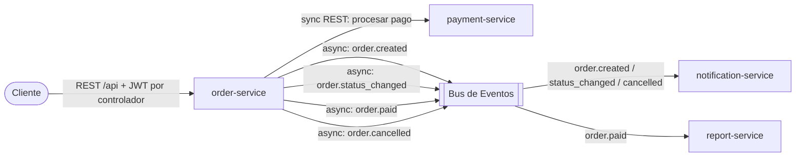

> `order-service` no llama directamente a `product-service` ni a `cart-service` porque el cliente envía los datos del carrito en el cuerpo de la petición al crear el pedido. Esto elimina dependencias innecesarias.

### 6.3 Dependencias que se decidió mantener

| Dependencia | Tipo | Por qué se permite |
|---|---|---|
| `order-service` → `payment-service` | Síncrona (REST) | El resultado del pago determina si el pedido avanza o no. No es posible hacerlo asíncrono porque el usuario necesita saber en el momento si su pago fue aceptado. |
| `auth-service` exporta `JwtAuthGuard` y `RolesGuard` | Dependencia de módulo | Todos los servicios necesitan validar el token JWT. Es una dependencia transversal y aceptable porque no implica lógica de negocio compartida, solo infraestructura de seguridad. |

### 6.4 Dependencias que se descartaron

| Dependencia descartada | Por qué se eliminó |
|---|---|
| `payment-service` → `order-service` | El servicio de pagos no necesita saber qué es un pedido. Solo recibe un monto, lo procesa y devuelve un resultado. Agregar esa dependencia habría creado un ciclo entre módulos. |
| `notification-service` → `order-service` (consulta directa) | Si `notification-service` consultara directamente a `order-service` para obtener datos del pedido, un fallo en `order-service` arrastraría al de notificaciones. Con eventos asíncronos, ambos son independientes. |
| `report-service` → `order-service` (acceso a BD) | La base de datos de pedidos es privada del `order-service`. Si `report-service` accediera directamente, cualquier cambio en el esquema de `order-service` podría romper los reportes. |
| BD compartida entre todos los servicios | Una sola base de datos crea acoplamiento estructural: un cambio en la tabla de pedidos podría afectar las consultas de pagos o reportes. Con bases de datos separadas (o esquemas separados en la implementación actual), cada módulo es responsable solo de su propio esquema. |

---

## 7. Justificaciones Arquitectónicas

### Decisión 1 — Microservicios vs. monolito como arquitectura general

**Decisión arquitectónica:** Definir la estructura general del backend de Fukusuke.

**Alternativa A:** Construir un monolito en Node.js con Express, organizando el código en módulos internos por dominio (auth, productos, pedidos, etc.) dentro de una sola aplicación.

**Descarte:** Se descarta porque, aunque es más rápido de desarrollar al inicio, no permite escalar partes individuales del sistema de forma independiente. El catálogo de productos recibe muchas más consultas que el módulo de reportes, pero en un monolito ambos escalan juntos. Además, un error en el módulo de notificaciones podría derribar toda la aplicación.

**Alternativa B:** Arquitectura de microservicios organizada por dominio de negocio, con comunicación REST y eventos.

**Selección:** Se selecciona la Alternativa B.

**Justificación:** Permite escalar `product-service` de forma independiente sin tocar `payment-service`. Mejora el aislamiento de fallos: si `notification-service` falla, los pedidos siguen procesándose normalmente. Cada módulo puede evolucionar, desplegarse y probarse de forma autónoma, lo que mejora la mantenibilidad y la escalabilidad del sistema a largo plazo.

---

### Decisión 2 — Separar auth-service de user-service

**Decisión arquitectónica:** Cómo dividir las responsabilidades relacionadas con los usuarios.

**Alternativa A:** Un solo servicio que gestione tanto la autenticación como el perfil del usuario y sus direcciones de despacho.

**Descarte:** Se descarta porque mezcla dos dominios que cambian por razones distintas. La autenticación (tokens, contraseñas, roles) es transversal y relativamente estable. El perfil del usuario (direcciones, datos personales) cambia con más frecuencia y por motivos de negocio. Un cambio en cómo se guardan las direcciones no debería afectar la lógica de generación de JWT.

**Alternativa B:** Dos servicios separados: `auth-service` para credenciales y tokens, y `user-service` para perfil y direcciones.

**Selección:** Se selecciona la Alternativa B.

**Justificación:** Cada servicio tiene mayor cohesión porque solo contiene lo que le corresponde. En la implementación concreta, `auth-service` gestiona la entidad `Credential` (tabla `credentials`: `email`, `passwordHash`, `role`, `active`, `userId`) y `user-service` gestiona la entidad `UserProfile` (tabla `user_profiles`: `run`, `fullName`, `phone`, `address`, `commune`, `province`, `region`, `birthDate`, `gender`). **Ningún módulo importa entidades del otro:** durante el registro, `auth-service` no manipula la entidad `UserProfile` directamente sino que **delega en `UsersService`** (`createProfile`, `findByRun`, `findById`), que es el único dueño de la tabla `user_profiles`. Para inyectar `UsersService` en `AuthService` —y a la vez exponer los guards de `auth` hacia `users`— ambos módulos se referencian con `forwardRef`. La vinculación entre perfil y credencial se realiza mediante el campo `userId` (UUID). Esto reduce el acoplamiento: un cambio en los campos del perfil no afecta la lógica de autenticación y vice versa. A futuro, si se quiere integrar otra aplicación con el sistema de autenticación de Fukusuke, se puede reutilizar `auth-service` de forma aislada.

**Tensión: atomicidad del registro.** El registro crea dos filas (un `UserProfile` y una `Credential`) en operaciones separadas. Conviene ser explícitos: **nunca existió una transacción de base de datos real** envolviendo ambas escrituras —no había `QueryRunner` ni `@Transaction` que las uniera—, ni siquiera cuando `auth-service` accedía a `UserProfile` directamente. Ese acceso directo daba una *ilusión* de atomicidad, pero si la segunda escritura fallaba quedaba igualmente un perfil huérfano. Por lo tanto, delegar la creación del perfil en `UsersService` **no introduce** ninguna pérdida de atomicidad: solo hace explícito un riesgo preexistente. Cerrar esa brecha queda como evolución futura, con dos caminos según cómo evolucione el despliegue: (a) mientras ambos servicios compartan la conexión PostgreSQL, envolver ambas operaciones en una transacción TypeORM (`dataSource.transaction(...)`); o (b) si los servicios se separan físicamente, aceptar consistencia eventual con un patrón de compensación (saga) en lugar de una transacción distribuida.

---

### Decisión 3 — Separar product-service de cart-service

**Decisión arquitectónica:** Gestión del catálogo de productos y del carrito de compras.

**Alternativa A:** Un solo servicio que maneje el catálogo de productos y el estado del carrito del usuario.

**Descarte:** Se descarta porque ambas cosas tienen patrones de uso muy distintos. El catálogo es consultado constantemente por todos los usuarios al mismo tiempo y sus datos cambian poco. El carrito es un estado mutable y efímero, diferente por cada usuario. Juntarlos complica el escalado y mezcla dominios que no tienen relación directa.

**Alternativa B:** `product-service` para el catálogo y `cart-service` para el carrito.

**Selección:** Se selecciona la Alternativa B.

**Justificación:** Permite aplicar estrategias distintas a cada servicio: el catálogo puede cachearse agresivamente, el carrito puede almacenarse en memoria (Redis). La alta cohesión de cada servicio hace que sea más fácil de mantener y evolucionar de forma independiente.

---

### Decisión 4 — Separar order-service de payment-service

**Decisión arquitectónica:** División entre la gestión de pedidos y el procesamiento de pagos.

**Alternativa A:** El `order-service` procesa los pagos directamente como parte de la confirmación del pedido.

**Descarte:** Se descarta porque la lógica de pago es sensible y cambia con frecuencia (nuevos medios de pago, cambios regulatorios). Mezclarla con la lógica de pedidos dificulta agregar nuevos métodos sin tocar el flujo del pedido y aumenta el riesgo de que un error en pagos afecte la creación de pedidos.

**Alternativa B:** `payment-service` independiente, con el patrón de herencia en `PaymentMethod` para manejar los distintos métodos.

**Selección:** Se selecciona la Alternativa B.

**Justificación:** Agregar un nuevo método de pago (como Webpay Plus) es simplemente crear una nueva subclase de `PaymentMethod` sin tocar `order-service`. La cohesión de `payment-service` es alta porque todas sus clases giran en torno al cobro. El acoplamiento entre pedidos y pagos se reduce a una sola llamada REST.

---

### Decisión 5 — Herencia en PaymentMethod vs. campo genérico

**Decisión arquitectónica:** Cómo modelar internamente los distintos métodos de pago dentro de `payment-service`.

**Alternativa A:** `PaymentService` recibe el tipo de pago como un string y toma decisiones con `if/else` o `switch`, guardando los datos del método en un campo genérico.

**Descarte:** Se descarta porque concentra toda la lógica de pago en un solo lugar, lo que reduce la cohesión del servicio y lo hace más difícil de mantener. Cada vez que se agrega un método nuevo hay que modificar el `if/else` existente, lo que aumenta el riesgo de errores.

**Alternativa B:** Clase abstracta `PaymentMethod` con los métodos `process()` y `validate()`, y tres subclases concretas: `CreditCardPayment`, `ServipagPayment` y `BankTransferPayment`.

**Selección:** Se selecciona la Alternativa B.

**Justificación:** El polimorfismo permite que `PaymentService` llame a `method.process(amount)` sin importar qué tipo concreto sea. Agregar un nuevo método de pago es crear una subclase nueva sin modificar código existente. Cada clase concreta tiene alta cohesión porque solo contiene la lógica del método que representa. El acoplamiento de `PaymentService` con los métodos concretos es mínimo.

---

### Decisión 6 — OrderItem copia los datos del producto vs. referencia directa

**Decisión arquitectónica:** Cómo `OrderItem` accede a la información del producto que se compró.

**Alternativa A:** `OrderItem` guarda una referencia directa al `Product` (ya sea como clave foránea o llamando a `product-service` en cada consulta de pedido).

**Descarte:** Se descarta porque si el precio de un producto cambia en el catálogo, los pedidos históricos mostrarían un precio distinto al que el cliente pagó realmente. Además, si `product-service` estuviera caído, no se podrían consultar pedidos antiguos, lo que crea una dependencia innecesaria en tiempo de ejecución.

**Alternativa B:** `OrderItem` copia los datos relevantes del producto en el momento de la compra: `productId`, `productName` y `unitPrice`.

**Selección:** Se selecciona la Alternativa B.

**Justificación:** Los pedidos históricos conservan el precio exacto que el cliente pagó, lo que es correcto desde el punto de vista del negocio. `order-service` puede responder consultas de pedidos antiguos sin depender de que `product-service` esté disponible. Esto reduce el acoplamiento entre servicios y mejora la mantenibilidad del historial de compras.

---

### Decisión 7 — Comunicación asíncrona para notificaciones y reportes

**Decisión arquitectónica:** Cómo `order-service` informa a `notification-service` y `report-service` sobre los eventos de pedidos.

**Alternativa A:** Llamadas REST síncronas: al crear un pedido, `order-service` llama directamente a `notification-service` y `report-service` antes de responder al cliente.

**Descarte:** Se descarta porque si `notification-service` falla o responde lento, la creación del pedido también fallaría o demoraría, aunque el correo de confirmación no es crítico para la transacción. Además, `order-service` tendría que conocer las URLs de todos los servicios que reaccionan a sus eventos, lo que aumenta el acoplamiento.

**Alternativa B:** Bus de eventos asíncrono: `order-service` emite eventos y los servicios interesados reaccionan de forma independiente mediante decoradores `@OnEvent`.

**Alternativa C:** Bus de eventos asíncrono pero sobre un **broker externo** (RabbitMQ, Kafka o AWS SQS) en lugar de `@nestjs/event-emitter` in-process.

**Descarte:** Se descarta para el alcance actual porque introduce complejidad de infraestructura y despliegue (un broker que provisionar, configurar, monitorear y mantener) que no se justifica mientras todos los microservicios corren como módulos dentro de un único proceso NestJS: en ese escenario el bus in-process entrega exactamente la misma semántica de desacople (el emisor no conoce a los consumidores) sin operar infraestructura adicional. Un broker externo solo se vuelve necesario cuando los servicios se **despliegan como procesos separados** y los eventos deben cruzar la frontera del proceso (entrega garantizada, reintentos, persistencia de mensajes), lo cual es evolución futura. Migrar de `@nestjs/event-emitter` a un broker no afecta a los servicios productores ni consumidores: solo cambia el transporte detrás de `emit()` y `@OnEvent`.

**Selección:** Se selecciona la Alternativa B.

**Justificación:** El pedido se crea correctamente sin importar el estado de `notification-service`. `order-service` no necesita saber que `notification-service` o `report-service` existen: solo emite el evento. En la implementación se utilizan cuatro eventos distintos: `order.created` (al persistir el pedido), `order.paid` (al transicionar a estado pagado), `order.status_changed` (en cualquier otra transición) y `order.cancelled` (al anular). `notification-service` reacciona a los tres primeros para registrar notificaciones al usuario, y `report-service` reacciona a `order.paid` para acumular las ventas en el reporte semanal. Si se agrega un nuevo servicio que reaccione a pedidos en el futuro, no hay que modificar `order-service`. Esto mejora la mantenibilidad y reduce significativamente el acoplamiento entre módulos.

---

### Decisión 8 — Base de datos por servicio vs. base de datos compartida

**Decisión arquitectónica:** Estrategia de persistencia de datos en la arquitectura.

**Alternativa A:** Una única base de datos PostgreSQL compartida entre todos los microservicios, con tablas o esquemas separados por servicio.

**Descarte:** Se descarta porque, aunque simplifica el despliegue inicial, crea acoplamiento estructural: un cambio en el esquema de la tabla `orders` podría afectar consultas de `payment-service` si acceden a la misma BD. También impide usar tecnologías distintas según las necesidades de cada servicio.

**Alternativa B:** Cada microservicio es responsable de sus propias entidades y no accede a las tablas de otro servicio (patrón Database per Service).

**Selección:** Se selecciona la Alternativa B, en su variante de **database-per-service _lógico_: tablas separadas por servicio sobre una misma conexión PostgreSQL** (`DATABASE_URL` única). Cada módulo registra exclusivamente sus propias entidades vía `TypeOrmModule.forFeature([...])` y ningún servicio consulta las tablas de otro. La separación **física** en bases de datos/conexiones distintas por servicio **no** forma parte de la selección actual: es una evolución futura (ver "Implementación actual" más abajo).

**Justificación:** Cada módulo puede evolucionar su esquema de forma independiente sin coordinación con otros equipos. Es posible usar Redis para el carrito (alta velocidad de lectura/escritura), PostgreSQL para pedidos (consistencia transaccional) y almacenamiento distinto para reportes, sin que un servicio afecte al otro. Esto mejora la escalabilidad y reduce el acoplamiento estructural entre módulos.

**Implementación actual:** En el MVP todos los módulos comparten una conexión PostgreSQL única (`DATABASE_URL`). La separación es real a nivel de tablas: cada módulo registra exclusivamente sus propias entidades mediante `TypeOrmModule.forFeature([...])` y ningún servicio consulta las tablas de otro módulo. Las tablas gestionadas son: `credentials` y `user_profiles` (auth), `saved_addresses` (users), `products` y `categories` (products), `carts` y `cart_items` (cart), `orders` y `order_items` (orders), `payments` (payments), `notifications` (notifications), `weekly_reports` y `daily_sales` (reports). Migrar a conexiones físicamente separadas por servicio es una evolución futura que solo requiere parametrizar `TypeOrmModule.forRootAsync` con URLs distintas por módulo.

---

## 8. Verificación con Tests Unitarios

Los tests unitarios respaldan directamente las afirmaciones arquitectónicas del documento. Todos los tests se ejecutan sin base de datos real, usando mocks del repositorio TypeORM (`getRepositoryToken`).

```bash
cd backend && npm test
```

| Archivo de test | Qué afirmación arquitectónica respalda |
|---|---|
| `auth/auth.service.spec.ts` | Registro crea `UserProfile` y luego `Credential` en ese orden; login verifica bcrypt; `getMe` combina perfil y credencial. Prueba el flujo completo de auth sin dependencias externas. |
| `users/users.service.spec.ts` | `getUserById` lanza `NotFoundException` si no existe; `updateProfile` aplica cambios parciales; `removeAddress` lanza `ForbiddenException` si la dirección pertenece a otro usuario. Prueba el control de acceso en user-service. |
| `orders/orders.service.spec.ts` | La máquina de estados rechaza transiciones inválidas; el control de roles impide a un cajero transicionar a `en_camino`; `EventEmitter2.emit` se invoca con `order.created` al crear un pedido y con `order.paid` al transicionar a `pagado`; `PaymentsService.processPayment` se llama cuando el DTO incluye `paymentData`. |
| `payments/payments.service.spec.ts` | El polimorfismo de `PaymentMethod` funciona con las 3 subclases (`tarjeta`, `servipag`, `transferencia`); un pago rechazado persiste con `status: rechazado`. |
| `notifications/notifications.service.spec.ts` | Los handlers `@OnEvent` (`handleOrderCreated`, `handleOrderStatusChanged`, `handleOrderCancelled`) invocan los métodos `notifyOrder*` correspondientes. |
| `reports/reports.service.spec.ts` | `handleOrderPaid` invoca `registerSale` con el monto del evento; `registerSale` crea o actualiza `WeeklyReport` y `DailySales` correctamente. |
